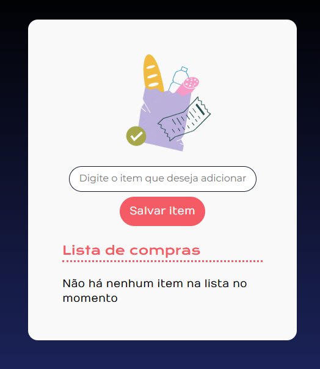
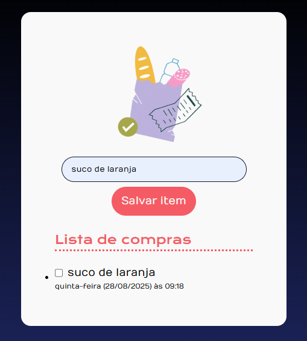

# 🛒 Lista de Compras

Este projeto é uma aplicação simples feita com **HTML, CSS e JavaScript** que permite criar uma lista de compras dinâmica.  
Você pode adicionar itens, marcar como concluídos e ver a data/hora de quando foram adicionados.

---

## 🚀 Funcionalidades

✅ Adicionar itens à lista  
✅ Marcar itens como concluídos (com um risco no texto)  
✅ Exibir a data e hora em que o item foi adicionado  
✅ Mensagem automática quando a lista está vazia  

---

## 🖼️ Preview
 
  

---

## 🔗 Link do Projeto 

https://silvinompfs.github.io/lista-de-compras/

## 🛠️ Tecnologias usadas

-  **HTML5** para a estrutura da página
-  **CSS3** para o estilo e layout
-  **JavaScript** (Módulos ES6) para a lógica da aplicação

---

## 📂 Estrutura do Projeto

📁 lista-de-compras
├── 📄 index.html # Página principal
├── 📄 styles.css # Estilos do projeto
├── 📄 index.js # Script principal
├── 📁 scripts # Funções separadas em módulos
│ ├── criarItemDaLista.js
│ ├── verificarListaVazia.js
│ └── gerarDiaDaSemana.js
└── 📁 img # Imagens usadas no projeto
